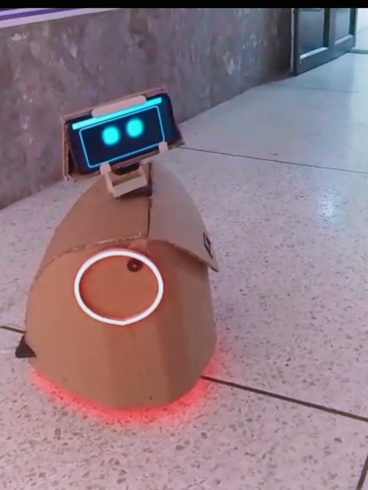

# Hamza Hafeez

**Founder · Engineer · AI Researcher**

Building systems that think, judge, and act.

## What I'm Building
<table>
<tr>
<td width="50%" valign="top">

### [Histeeria](https://www.histeeria.com) &nbsp;·&nbsp; The Judgment Layer for AI Agents

> *"Don't just monitor what your agent did. Know whether it should be trusted."*

An 8-dimension behavioral scoring framework that generates a **judgment profile** for every agent run. Full stack: SDK → evaluation pipeline → monitoring dashboard → analytics → PDF reports.

**Founder & Sole Engineer** &nbsp;·&nbsp; [histeeria.com](https://www.histeeria.com)
  open-source at: [github.com/histeeria](https://github.com/histeeria) 
</td>
</tr>
<table>

### [Cortex](https://www.cortex-edr.com) &nbsp;·&nbsp; AI Application Security Analyst

> *"Nothing Ships Broken."*

AI writes the code. Pipelines deploy it. Nobody's watching the architecture become the vulnerability.  
Cortex catches what your pipeline misses

Open-source, local-first CLI. Free, model-agnostic. 

**Founder & Chief Engineer** &nbsp;·&nbsp; [npm](https://www.npmjs.com/package/@cortexedr/cli) &nbsp;·&nbsp; [github](https://github.com/Cortex-EDR) &nbsp;·&nbsp; [cortex-edr.com](https://www.cortex-edr.com)

---

### [Anya](https://github.com/hmza-hb/Anya) &nbsp;·&nbsp; Emotionally-Aware companion Robot
*< passion project >*

An open-source OS for a buddy-form-factor robot. Personality inspired by Anya from Spy × Family.  
Three-layer parallel perception; environment, people, self, collapsing into a single thought before she speaks.  
Emotions are probabilistic, not binary. She never stops perceiving while she talks.
  (This is a hardware + software projec)

[github →](https://github.com/hmza-hb/Anya)

---

## Research &nbsp;·&nbsp; [Project Cortex](https://github.com/hmza-hb/Project-Cortex)

> *A Prefrontal Cortex-Inspired Architecture for General Intelligence*

LLMs have local competence. No global executive control. This is the architecture that fixes that.  
 Acknowledged by **57 researchers** across AI, neuroscience, and cognitive science.

[read the paper →](https://github.com/hmza-hb/Project-Cortex)

---

## Also I ran

### [Upvista Digital](https://www.upvistadigital.com)
My dev studio. Custom software, AI solutions, security auditing, and cloud infra. Clients across Japan, US, UK, Germany, New Zealand, and Pakistan.

[Upvista Digital →](https://linkedin.com/company/upvista-digital)

---

## GitHub Activity

*"building systems that think, feel, and judge best."*

**Hamza Hafeez** · 2026

